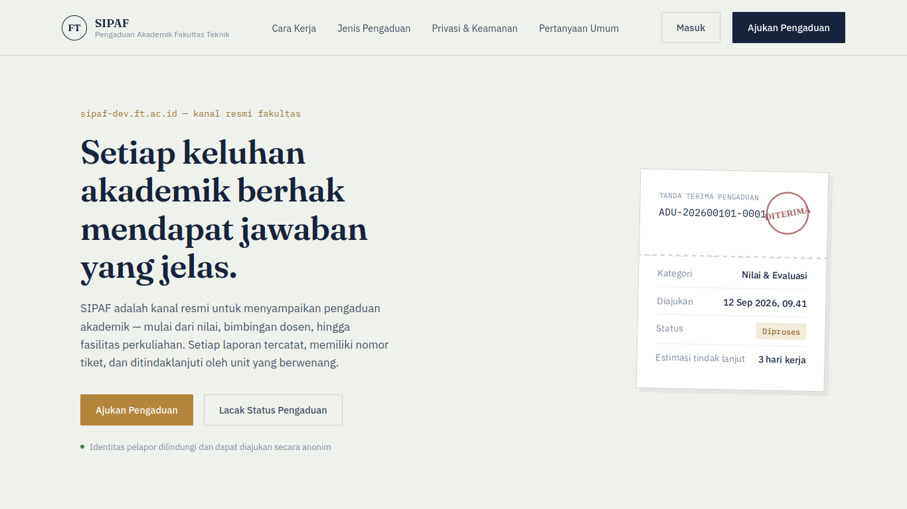

<p align="center"><a href="https://laravel.com" target="_blank"></a></p>

<p align="center">


</p>

<h1 align="center">Sistem Informasi Pengaduan Fakultas — Universitas Peradaban</h1>

<p align="center">
SIPAF is the official channel for submitting academic complaints—ranging from grades and faculty guidance to lecture facilities. Every report is logged, assigned a ticket number, and followed up on by the relevant unit.
</p>

---

## Preview
<p align="center">

</p>

---

## Tech Stack

- **Backend:** Laravel + Laravel Octane (FrankenPHP)
- **Frontend:** Blade
- **Database:** MySQL

---

## Requirements

Before installing, make sure your environment has:

- PHP >= 8.2
- Composer
- Node.js & NPM
- MySQL (or another Laravel-supported database)
- Git

---

## Installation Guide

Follow these steps to install the project locally or on a server.

### 1. Clone the Repository

```bash
git clone
cd sipaf
```

### 2. Install Dependencies

Install all backend packages (Composer) and frontend assets (NPM):

```bash
composer install
npm install
```

### 3. Configure the Environment

Copy the example `.env` file and generate a new application key:

```bash
cp .env.example .env
php artisan key:generate
```

**Starting AI Assistant:**
```bash
OPENROUTER_KEY=YOUR_API_KEY
```

> **Note:** Adjust the database settings (`DB_DATABASE`, `DB_USERNAME`, `DB_PASSWORD`) in your `.env` file to match your local setup.

### 4. Run Migrations & Link Storage

Run the database migrations and create the storage symlink (required for uploaded panorama images to be publicly accessible):

```bash
php artisan db:seed
php artisan migrate
php artisan storage:link
```

---

## Running the Application

This project uses Laravel Octane with the FrankenPHP server. Choose the mode that fits your workflow.

### A. Local Development

**Option 1 — Default Artisan server**

```bash
php artisan serve
```

**Option 2 — Octane with Vite (recommended for active development)**

1. install lib frankenphp
```bash
php artisan octane:install
```

Use the included `dev.sh` script to run Vite (NPM) and the Octane server together in one command.

1. Grant execute permission to the script (only needed once):

```bash
    chmod +x dev.sh
```

2. Run the script:

```bash
    ./dev.sh
```

   This script runs `npm run dev` and `php artisan octane:start --watch` in parallel, so frontend and backend changes are picked up automatically.

---

## License

This project is built on the [Laravel](https://laravel.com) framework, which is open-sourced software licensed under the [MIT license](https://opensource.org/licenses/MIT).
